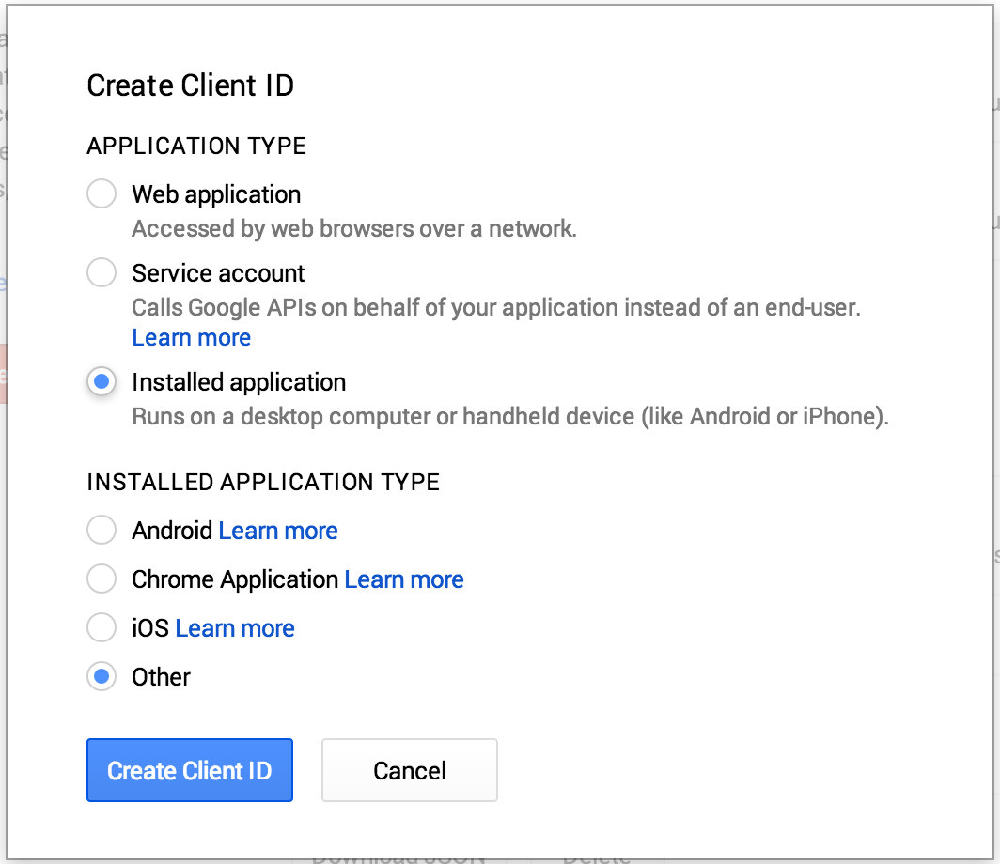

ga
==

Google Analytics via the Command Line

# THIS IS A WORK IN PROGRESS, CURRENTLY AUTH IS WORKING


## API Keys
To apply for API access at the Google APIs Console:

- Visit the [Google APIs Console](https://code.google.com/apis/console). Log in if prompted to do so.
- Create a project for your application (if you have not already done so) by clicking Create project.
- Select **APIS & AUTH > APIs** from the side menu. The list of accessible Google services appears.
- Scroll through the list until you find **Google Analytics**, click the Status switch next to the service name (so that it switches from OFF to ON). *NOTE:* google autmoatically will have other services turned on you can switch those off as long as you keep **Google Analytics** on.
- For some services, the Console will display a Terms of Service pane. To go ahead, check the I agree to these terms box, then click Accept.
- Scroll back to the top of the page and **APIS & AUTH > Credentials** in the side menu.
- The API Access pane appears.
- Click Create an OAuth 2.0 Client ID.
- The Create Client ID dialog appears.
- Click the *Installed Application* radio button and *Other*. It should look like below:
    
- Click Create.
- The credentials under **Client ID for native application** can be used when prompted by `ga --configure`

## Installation

#### Via Go

```bash
$ go get github.com/jfrazelle/ga
```

#### Binaries

- **darwin** [386](https://jesss.s3.amazonaws.com/ga/binaries/darwin/386/ga) / [amd64](https://jesss.s3.amazonaws.com/ga/binaries/darwin/amd64/ga)
- **freebsd** [386](https://jesss.s3.amazonaws.com/ga/binaries/freebsd/386/ga) / [amd64](https://jesss.s3.amazonaws.com/ga/binaries/freebsd/amd64/ga) / [arm](https://jesss.s3.amazonaws.com/ga/binaries/freebsd/arm/ga)
- **linux** [386](https://jesss.s3.amazonaws.com/ga/binaries/linux/386/ga) / [amd64](https://jesss.s3.amazonaws.com/ga/binaries/linux/amd64/ga) / [arm](https://jesss.s3.amazonaws.com/ga/binaries/linux/arm/ga)


## Usage


[](https://github.com/jfrazelle/ga)